# SOUL & SURF

Soul & Surf is a website that hopes to help in those days where the waves are small, bring people together to meet up for surf-improvement exercices activitis on regular basis in Bundoran, Ireland. The site will be targeted towards surfers who are looking for a way to socialise with the local surf community and keep themselves fit for the big days. Soul & Surf will be useful for surfers to see exactly when and where they should be to join the activitys.

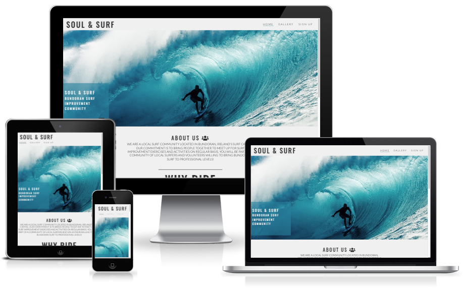

## Design
Colour Scheme were choosen to bring that beach feeling environment and to contrast colours for people better perceive the information, colours chosen was a variety of greens, blues and greys for our site.

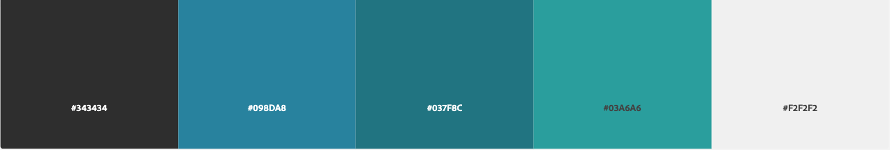

## Typography

Google Fonts was used to import the chosen fonts for use in the site.

CSS rules to specify families

font-family: 'Encode Sans Semi Condensed', sans-serif;

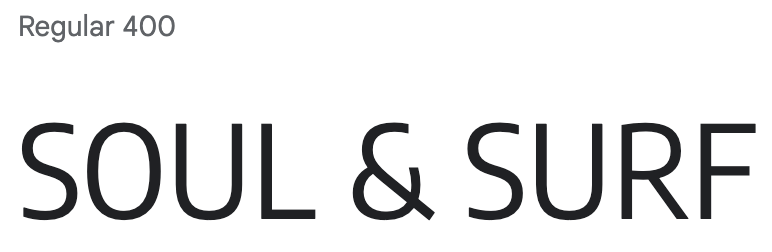

font-family: 'Oswald', sans-serif;

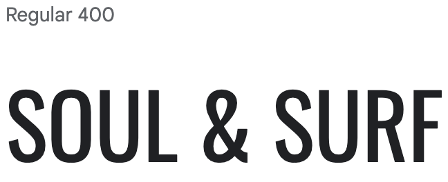

@import url('https://fonts.googleapis.com/css2?family=Encode+Sans+Semi+Condensed&family=Oswald&display=swap');

## Imagery

All imagery used within the site has been chosen from https://www.pexels.com taken by the photographers bellow:

Photos by: 

           Nick Wehrli
           
           Kammeran Gonzalez-Keola
           
           Jess Loiterton
           
## Wireframes

Wireframes were created for mobile, tablet and desktop using Figma.

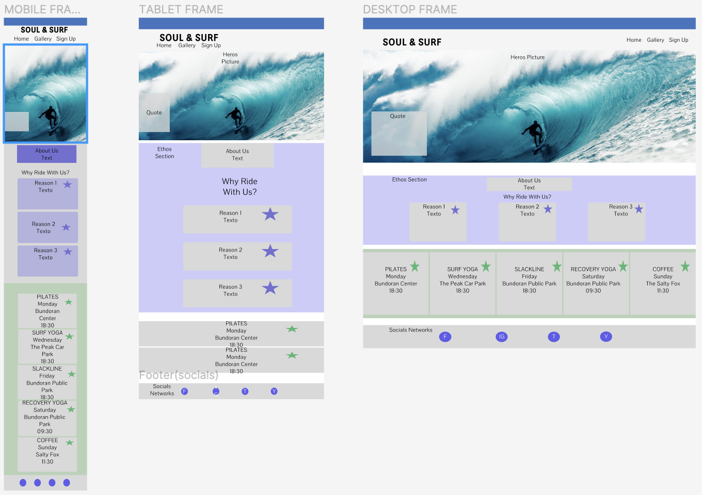

## Features

### Existing Features

#### Navigation Bar

The Navigation Bar is 100% reposive for all types of devices. It contains links to the Logo on the left side and to the navigation menu on the right side of the bar, the menu cosist of a Home page, Gallery and Sign up page, in which all this pages the navigation bar will be feature the same.

This Navigation menu will help the user easily navigate through the website across all screen sizes without having to use a back button to goes back to previous pages. 

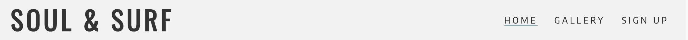

#### The Surfer page image

The Surfer page contain a photograph with textbox, which gives to the user the location and a hint of what is the porpouse of the page.

The text box gives a small introduction and the image gives an achivement sensation to user looking for improvement also it has a nice animation to grab users attention.

(The animation was inpired by Love Running project from CI)

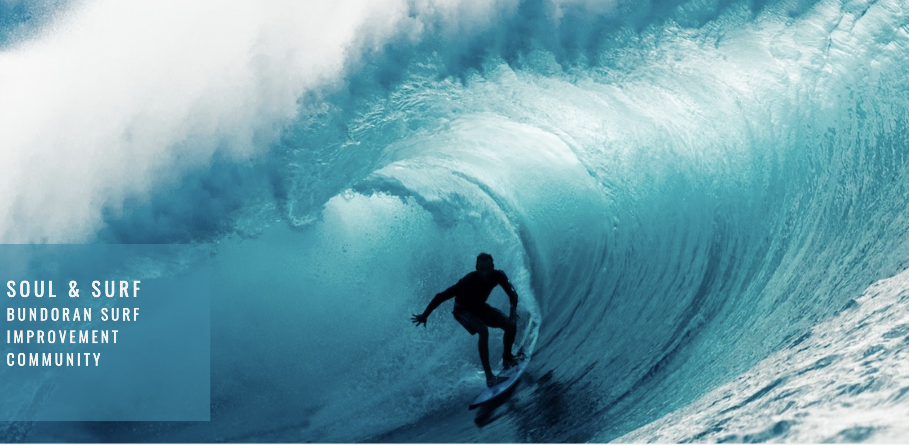

#### About Us Section

The About Use Section will introduce the community to the user and what is the commitment of this community.

This will welcome users and make them fell as they already belong to the community.

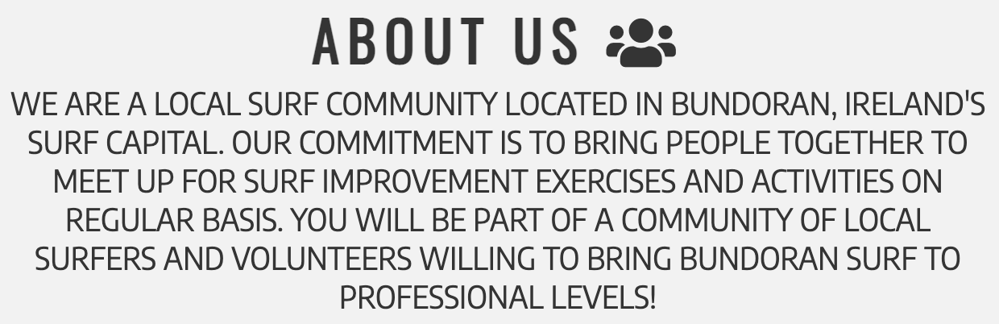

#### Reasons Why to Ride with Us Section

This section will present to the users the areas they will be improving when surfing with Soul & Surf community.

The user will see what can be achive by improving this area and the impact it can have on their surfing. This should encourage the users joining the surf community.

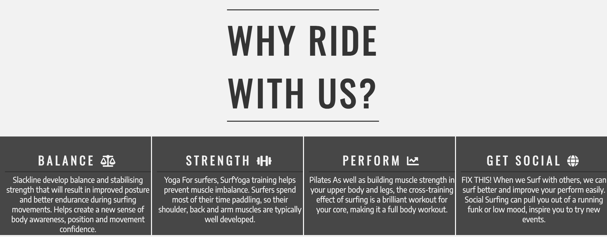

#### Meetup Times & Locations Section

This section will provide the user with the information such as activity type, time and location where the activity take place.

This section will be updated weekly as it can suffer cancelations by anytime in case we forecast good waves.

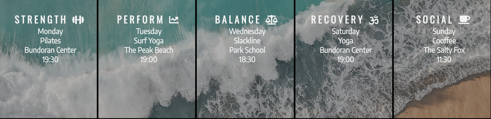

#### The Footer

This section has all the links to the social media sites for Soul & Surf. 

The links will open to a new tab to allow easy navigation for the user.

This footer will encourage user to joing Soul & Surf social medias.

This footer will be featured in all pages identical.

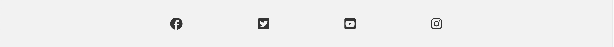

#### Gallery

This gallery is to users see the community activitys and daily moments of the surfers in Bundoran.

This section brings a sense of community and belonging to the user as they will see in this pictures the community lifestyle.

(This alignment style for the photos was inspired by Love Running Project from CI)

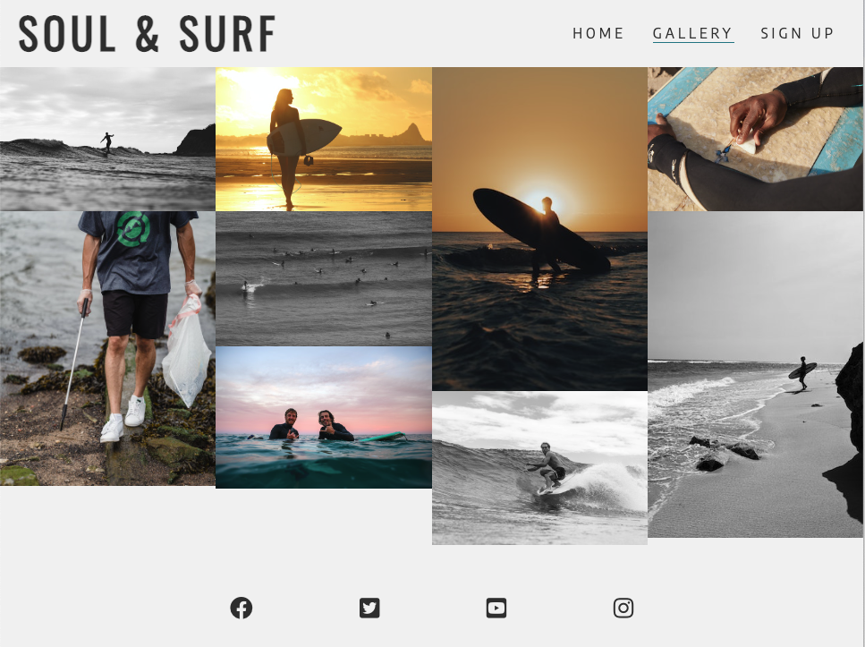

#### The Sign Up Page

This section will allow users to signup to be part of the community.

The user will choose an activity of more interess to track which one has more demand.

The user will be asked to submit their full name and email address.

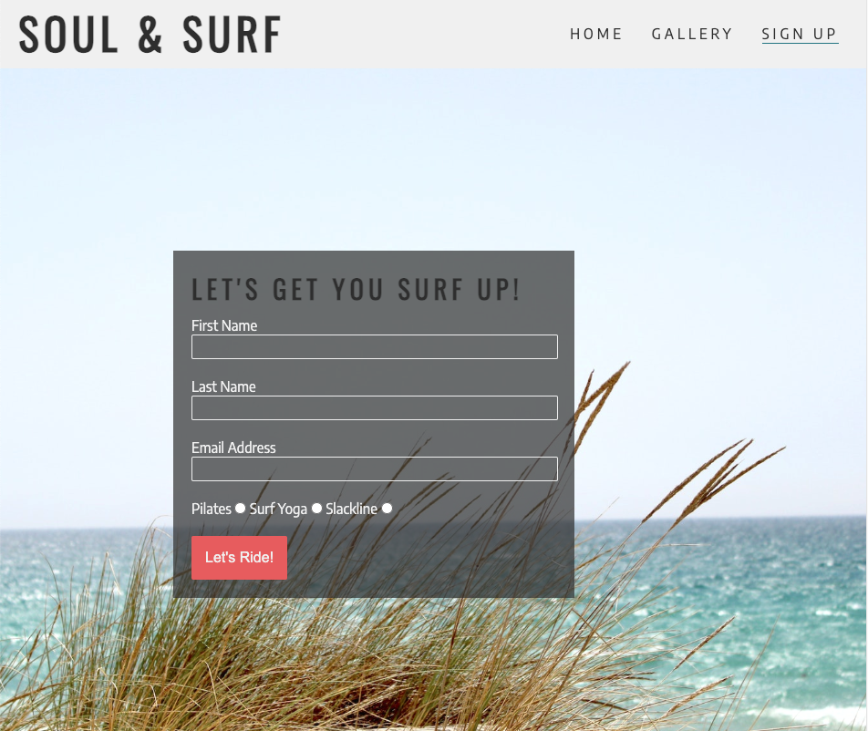

(This form style and signup buttom was inspired by Love Running Project from CI)

## Features Left to Implement

- HAMBURGUER MENU

- CENTER TEXT FOR MEET UP TIMES

## Testing

This website has been put through testing since the begining and at every stage of the building, I made use of W3C and Jigsaw validator.
In additional, google Chrome developer tool was used for troubleshooting.

We used google Chrome developer tool & Firefox inspector tool to make sure pages are responsive to different screen sizes and devices.

All the pages were tested using Lighthouse within the Chrome Developer Tools to test the performance, accessibility, best practices and SEO of the website.

The lighthouse scores are very good, with some things that could be improved. A future implementation would be to convert all images to the webp format. 

### Validator Testing

HTML
No errors were returned when passing through the official W3C validator

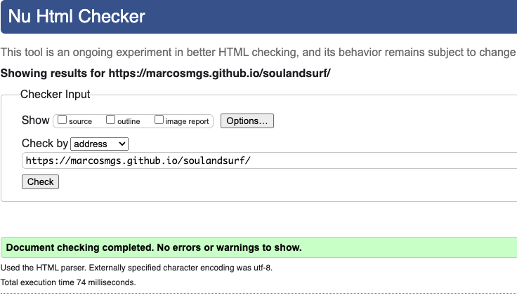

CSS
No errors were found when passing through the official (Jigsaw) validator

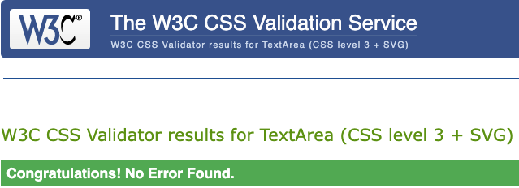

Lighthouse Scores

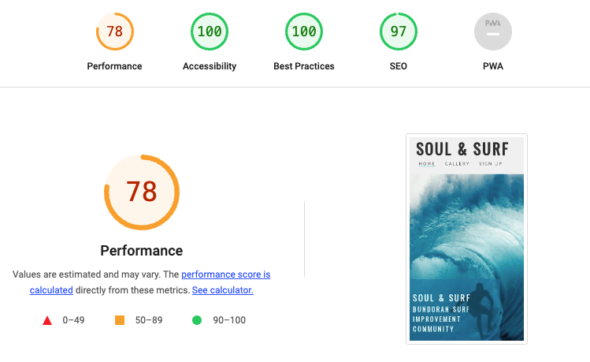

In this section, you need to convince the assessor that you have conducted enough testing to legitimately believe that the site works well. Essentially, in this part you will want to go over all of your project’s features and ensure that they all work as intended, with the project providing an easy and straightforward way for the users to achieve their goals.

In addition, you should mention in this section how your project looks and works on different browsers and screen sizes.

You should also mention in this section any interesting bugs or problems you discovered during your testing, even if you haven't addressed them yet.

If this section grows too long, you may want to split it off into a separate file and link to it from here.

Unfixed Bugs

You will need to mention unfixed bugs and why they were not fixed. This section should include shortcomings of the frameworks or technologies used. Although time can be a big variable to consider, paucity of time and difficulty understanding implementation is not a valid reason to leave bugs unfixed.

## Deployment

The site is deployed using GitHub Pages - [Soul & Surf](https://marcosmgs.github.io/soulandsurf/).

The steps to deploy are as follows: 

1. Login (or signup) to Github.
2. Go to the repository for this project, [marcosmgs/Soul & Surf](https://github.com/kera-cudmore/TheQuizArms).
3. Click the settings button.
4. Select pages in the left hand navigation menu.
5. From the source dropdown select main branch and press save.
6. The site has now been deployed, please note that this process may take a few minutes before the site goes live.

## Credits
In this section you need to reference where you got your content, media and extra help from. It is common practice to use code from other repositories and tutorials, however, it is important to be very specific about these sources to avoid plagiarism.

You can break the credits section up into Content and Media, depending on what you have included in your project.

## Content
The text for the Home page was taken from Wikipedia Article A
Instructions on how to implement form validation on the Sign Up page was taken from Specific YouTube Tutorial
The icons in the footer were taken from Font Awesome
## Media
The photos used on the home and sign up page are from This Open Source site
The images used for the gallery page were taken from this other open source site
Congratulations on completing your Readme, you have made another big stride in the direction of being a developer!

## Other General Project Advice
Below you will find a couple of extra tips that may be helpful when completing your project. Remember that each of these projects will become part of your final portfolio so it’s important to allow enough time to showcase your best work!

One of the most basic elements of keeping a healthy commit history is with the commit message. When getting started with your project, read through this article by Chris Beams on How to Write a Git Commit Message

Make sure to keep the messages in the imperative mood
When naming the files in your project directory, make sure to consider meaningful naming of files, point to specific names and sections of content.

For example, instead of naming an image used ‘image1.png’ consider naming it ‘landing_page_img.png’. This will ensure that there are clear file paths kept.
Do some extra research on good and bad coding practices, there are a handful of useful articles to read, consider reviewing the following list when getting started:

Writing Your Best Code
HTML & CSS Coding Best Practices
Google HTML/CSS Style Guide
Getting started with your Portfolio Projects can be daunting, planning your project can make it a lot easier to tackle, take small steps to reach the final outcome and enjoy the process!

