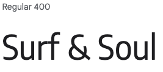
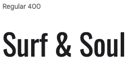
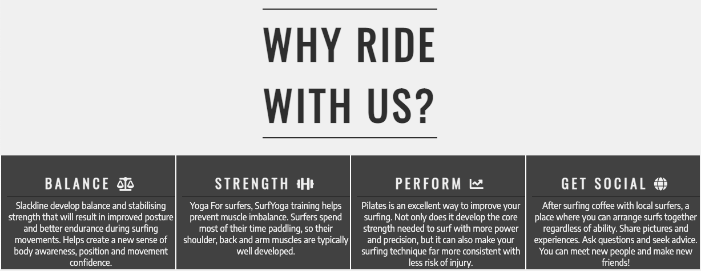

# SOUL & SURF

Soul & Surf is a website that hopes to help in those days where the waves are small, bring people together to meet up for surf-improvement exercise activities on regular basis in Bundoran, Ireland. The site will be targeted towards surfers who are looking for a way to socialise with the local surf community and keep themselves fit for the big days. Soul & Surf will be useful for surfers to see exactly when and where they should be to join the activities.

- - -

## CONTENTS

* [Colour Design](#design)
* [Typography](#typography)
* [Wireframes](#wireframes)
* [Features](#features)
  * [Navigation Bar](#navigation-bar)
  * [The Surfer Page Image](#the-surfer-page-image)
  * [About Us Section](#about-us-section)
  * [Reasons Why to Ride with Us Section](#reasons-why-to-ride-with-us-section)
  * [Meetup Times & Locations Section](#meetup-times-and-locations-section)
  * [The Footer](#the-footer)
  * [Gallery](#gallery)
  * [The Sign Up Page](#the-sign-up-page)
  * [Features Left to Implement](#features-left-to-implement) 
* [Testing](#testing)
  * [Validator Testing](#validator-testing)
  * [Unfixed Bugs](#unfixed-bugs)
* [Deployment](#deployment)
* [Credits](#credits)
  * [Content](#content)
  * [Imagery](#imagery)

- - -

## Design
Colour Scheme were chosen to bring that beach feeling environment and to have more contrast for people better perceive the information, colours chosen was a variety of greens, blues and greys for our site.

## Typography

Google Fonts was used to import the chosen fonts for use in the site.

CSS rules to specify families

font-family: 'Encode Sans Semi Condensed', sans-serif;

font-family: 'Oswald', sans-serif;

@import url('https://fonts.googleapis.com/css2?family=Encode+Sans+Semi+Condensed&family=Oswald&display=swap');
        
## Wireframes

Wireframes were created for mobile, tablet and desktop using Figma.

## Features

### Existing Features

#### Navigation Bar

The Navigation Bar is 100% responsive for all types of devices. It contains links to the Logo on the left side and to the navigation menu on the right side of the bar, the menu consist of a Home page, Gallery and Sign up page, in which all this pages the navigation bar will be feature the same.

This Navigation menu will help the user easily navigate through the website across all screen sizes without having to use a back button to goes back to previous pages. 

#### The Surfer Page Image

The Surfer page contain a photograph with a text box, which signal to the user the location and a hint of what is the purpose of the page.

The text box gives a small introduction and the image gives an achievement sensation to user looking for improvement also it has a motion animation to grab users attention.

(The animation was inpired by Love Running project from CI)

#### About Us Section

The About Us Section will introduce the community to the user and what is the commitment of this community.

This will welcome users and make them fell as they already belong to the community.

#### Reasons Why to Ride with Us Section

This section will present to the users the areas they will be improving when surfing with Soul & Surf community.

The user will see what can be achieve by improving this area and the impact it can have on their surfing. This should encourage the users joining the surf community.

#### Meetup Times and Locations Section

This section will provide the user with the information such as activity type, time, location and where the activity will take place.

This section will be updated weekly as it can suffer cancelations by anytime in case of a forecast of good waves.

(This background style for the meet up section was inspired by Coders Coffeehouse Project from CI)

#### The Footer

This section has all the links to the social media sites for Soul & Surf.

The links will open to a new tab to allow easy navigation for the user.

This footer will encourage user to join Soul & Surf social medias.

This footer will be featured in all pages identical.

#### Gallery

This gallery is to users see the community activities and daily moments of the surfers in Bundoran.

This section brings a sense of community and belonging to the user as they will see in this pictures the community lifestyle.

(This alignment style for the photos was inspired by Love Running Project from CI)

#### The Sign Up Page

This section will allow users to signup to be part of the community.

The user will be asked to submit their full name, email address and exercise preference.

(This form style and signup buttom was inspired by Love Running Project from CI)

## Features Left to Implement

- HAMBURGUER MENU

## Testing

This website has been put through testing since the beginning and at every stage of the building, I made use of W3C and Jigsaw validator.
In additional, google Chrome developer tool was used for troubleshooting.

We used google Chrome developer tool & Firefox inspector tool to make sure pages are responsive to different screen sizes and devices.

All the pages were tested using Lighthouse within the Chrome Developer Tools to test the performance, accessibility, best practices and SEO of the website.

The lighthouse scores are very good, with some things that could be improved. A future implementation would be to convert all images to the webp format and a hamburger menu for mobile devices. 

### Validator Testing

HTML
No errors were returned when passing through the official W3C validator

CSS
No errors were found when passing through the official (Jigsaw) validator

Lighthouse Scores

### Unfixed Bugs

No bugs were found, but a reduction of the payload size of the image would improve considerable the page as large network payloads cost users real money and are highly correlated with long load times.

## Deployment

The site is deployed using GitHub Pages - [Soul & Surf](https://marcosmgs.github.io/soulandsurf/).

The steps to deploy are as follows: 

1. Login (or signup) to Github.
2. Go to the repository for this project, [marcosmgs/Soul & Surf](https://github.com/kera-cudmore/TheQuizArms).
3. Click the settings button.
4. Select pages in the left hand navigation menu.
5. From the source dropdown select main branch and press save.
6. The site has now been deployed, please note that this process may take a few minutes before the site goes live.

## Credits

### Content

The text content for the Reasons Why section was taken from the websites bellow:

        https://www.fluidlifepilates.com

        https://en-gb.facebook.com/groups/1763135520624875/

        http://www.fitnessforsurfers.com

        https://www.thewave.com

The icons in the footer were taken from Font Awesome: https://fontawesome.com/

The motion animation for the Surfer Image was inspired by Love Running project from CI

The background style for the meet up section was inspired by Coders Coffeehouse Project from CI

Signup form style and gallery alignment style were inspired by Love Running Project from CI

### Imagery

All imagery used within the site has been chosen from https://www.pexels.com taken by the photographers bellow:

Photos by: 

           Nick Wehrli
           
           Kammeran Gonzalez-Keola
           
           Jess Loiterton
